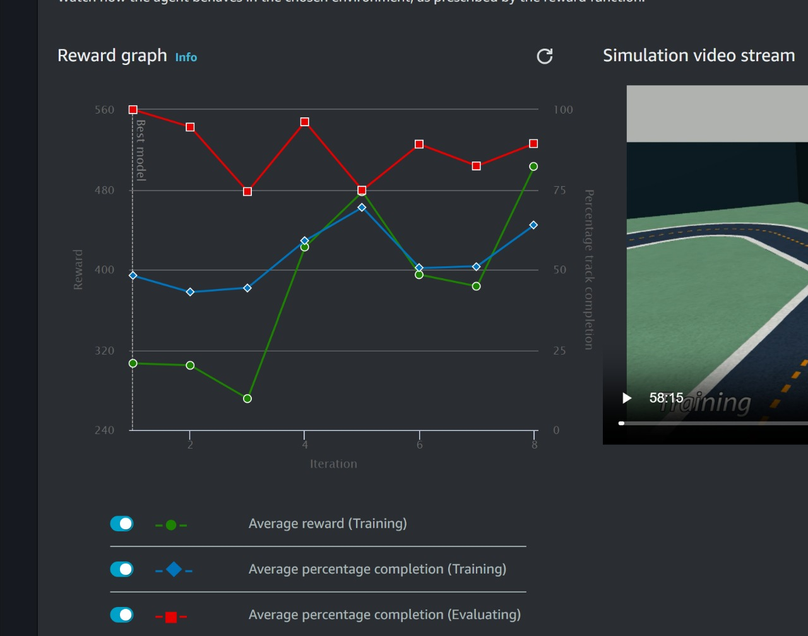
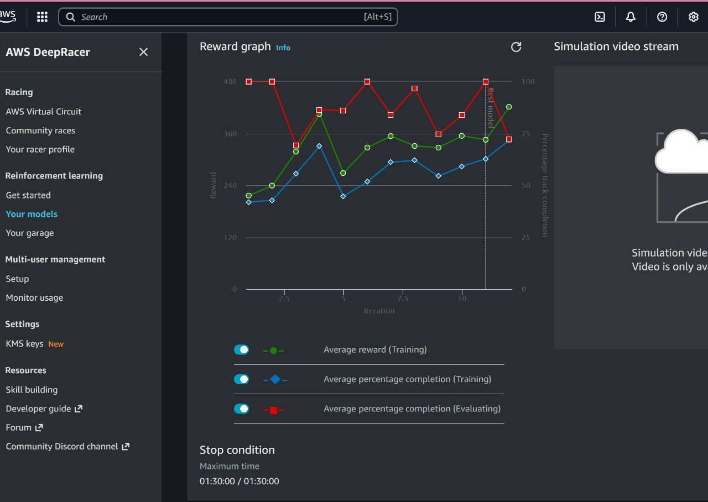
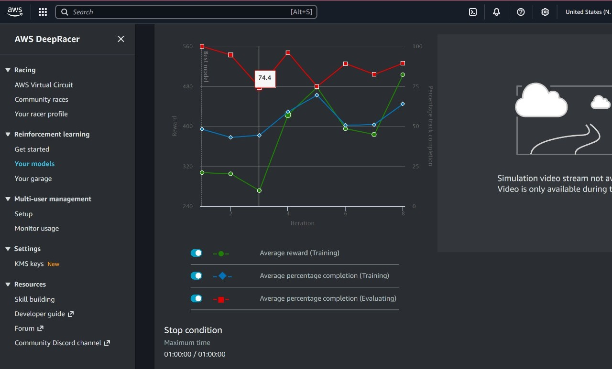

# Autonomous Racing Reinforcement Learning Model  
*A2RL STEM League – ATRC & AWS*

## Overview
This repository contains a **trained Reinforcement Learning (RL) model** developed and optimized during the **A2RL STEM League**, an autonomous racing competition organized by **ATRC** in collaboration with **AWS**. The challenge required participants to design, train, and evaluate RL agents capable of completing racing laps efficiently, safely, and consistently within a simulated autonomous racing environment.

The provided model represents a **final stabilized training outcome**, prioritizing **robustness, smooth control behavior, and reliable lap completion** over aggressive but inconsistent speed-focused strategies.

---

## Model File
**File name:**  
`stabilizing-trial3-clone1-model.tar.gz`

**Description:**  
This archive contains the trained policy and associated parameters generated through iterative reinforcement learning training. The model was refined across multiple training trials and cloned optimization stages, with this version selected for its stable and repeatable evaluation performance.

---

## Technical Context

### Learning Paradigm
- **Approach:** Reinforcement Learning
- **Type:** Policy-based RL (competition-standard setup)
- **Objective:**  
  Maximize lap completion consistency while maintaining optimal racing lines and minimizing off-track events.

### Environment
- Autonomous racing simulation environment used in the A2RL STEM League
- Agent–environment interaction based on:
  - State observations (track position, speed, heading, progress)
  - Continuous action space (steering angle, throttle control)
  - Reward-driven learning signals

---

## How It Was Trained

### 1. Reward Function Design
Training began with the design of a **custom reward function** aligned with autonomous racing constraints. The reward logic emphasized:

- Staying within track boundaries
- Alignment with the racing line
- Smooth steering behavior to reduce oscillations
- Controlled throttle usage to avoid instability
- Penalization of off-track behavior, abrupt steering, and excessive speed changes

The reward function was iteratively refined to balance **speed, stability, and safety**, encouraging consistent driving behavior rather than short-term aggressive gains.

---

### 2. Training Trials and Iteration
Multiple training trials were executed using different configurations, including:
- Reward weight adjustments
- Exploration–exploitation tuning
- Sensitivity refinements to state observations

Each trial was evaluated using:
- Lap completion rate
- Frequency of off-track events
- Steering smoothness
- Behavioral consistency across repeated runs

Underperforming configurations were discarded early, while promising runs were retained for deeper optimization.

---

### 3. Model Cloning and Fine-Tuning
High-performing checkpoints were **cloned** and used as starting points for additional training rounds. This approach enabled:
- Faster convergence
- Preservation of learned stable behaviors
- Incremental improvements without retraining from scratch

Cloning allowed controlled experimentation with refined reward configurations while maintaining a stable policy foundation.

---

### 4. Stabilization Phase
The final training phase focused on **behavior stabilization**, prioritizing:
- Reduction of steering jitter
- Smoother corner negotiation
- Improved recovery near track boundaries
- Consistent throttle modulation

At this stage, training emphasized **predictability and reliability** over marginal speed improvements.

---

### 5. Evaluation and Selection
Candidate models were evaluated through repeated simulation runs under identical conditions. Selection criteria included:
- Consistent lap completion
- Low variance in driving behavior
- Minimal off-track penalties
- Smooth and controlled action outputs

The selected model demonstrated **repeatable and stable performance**, making it suitable as a reference and baseline model.

---

## Training Experiments and Model Variants

During training, multiple **model clones** were generated from promising checkpoints to explore policy behavior under refined reward configurations and extended training durations.

Each clone represents an independent continuation of training, enabling comparison across:
- Reward convergence trends
- Track completion stability
- Behavioral smoothness
- Sensitivity to reward shaping adjustments

### Clone-Level Training Metrics

The following reward graphs document representative cloned training runs and illustrate how experimental results guided final model selection.

#### Clone 1 – Stabilization-Oriented Training

- Focused on reducing steering oscillation
- Achieved improved reward stability after early variance
- Demonstrated consistent evaluation completion rates  
- Selected as the foundation for the final model

#### Clone 2 – Reward Sensitivity Exploration

- Tested alternative reward weightings
- Exhibited faster reward growth but higher variance
- Used as a comparative reference rather than final selection

#### Clone 3 – Extended Fine-Tuning

- Continued training from a stabilized checkpoint
- Improved completion consistency across evaluations
- Contributed insights used in final policy refinement

---

## Key Features of the Model
- Optimized for stable autonomous driving behavior
- Reduced steering oscillation and over-correction
- Improved recovery near track boundaries
- Balanced speed and control trade-offs
- Suitable as a baseline for further experimentation or fine-tuning

---

## Usage Notes
This model is provided for:
- Academic demonstration
- Competition documentation
- Portfolio and research reference

It can be:
- Loaded into compatible autonomous racing or RL evaluation environments
- Used as a starting point for further training
- Analyzed to study reward-function effectiveness and policy behavior

---

## Project Context
This work was completed as part of the **A2RL STEM League**, where participants were required to:
- Apply reinforcement learning concepts in practice
- Design and optimize reward functions
- Train autonomous agents under real-world constraints
- Evaluate models using performance and stability metrics

The project provided hands-on experience in:
- Reinforcement learning optimization
- Autonomous systems development
- Iterative experimentation and evaluation
- AI model performance analysis

---

## Author
**Manar Omar**  
Fourth-year Information Systems student  
Ajman University  

This project forms part of my broader work in **AI, machine learning, and software engineering**, alongside academic, competition, and industry experience.

---

## License / Disclaimer
This repository is intended for **educational and portfolio purposes**.  
The model reflects competition-based experimentation and may require adaptation for other environments or real-world systems.
